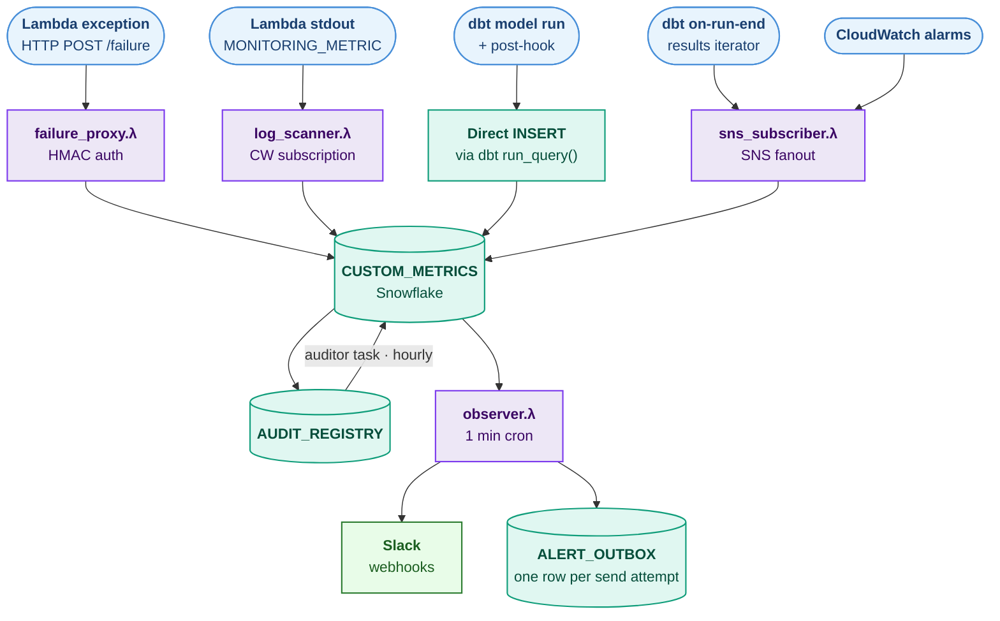

# Monty — Data Platform Monitoring

Monty is a single, opinionated monitoring platform for the Sweat data stack.
Every metric — pipeline failures, data-quality breaches, business KPIs,
operational counters — flows into one Snowflake table; one Slack-delivery
Lambda is the only thing that talks to Slack; one config table runs the SQL
checks that page on-call.

> **Architecture narrative:** [`architecture.md`](architecture.md)
> **Diagram:** [`unified_monitoring_alert_architecture.svg`](unified_monitoring_alert_architecture.svg)
> **Adding metrics from a new repo / language / tool:** [`ADD_METRIC.md`](ADD_METRIC.md)
> — copy-paste templates and a decision tree for picking the right integration path.


---

## 1. Overview





**Three Snowflake tables in `MONITORING_DB.MONITORING`:**

| Table | Purpose |
| --- | --- |
| `CUSTOM_METRICS` | Inbox for every metric. `is_alert=TRUE` rows get paged. |
| `AUDIT_REGISTRY` | SQL-based rules. `auditor_task` evaluates these hourly and writes results back into `CUSTOM_METRICS`. |
| `ALERT_OUTBOX` | One row per Slack delivery attempt. Decouples "metric arrived" from "Slack accepted it" so retries don't double-alert. |

**Four AWS Lambdas (all share one Docker image; `CMD` differs per handler):**

| Lambda | Trigger | What it does |
| --- | --- | --- |
| `failure_proxy` | API Gateway `POST /failure` | HMAC-validates body, writes one row. dbt + AWS-ingest exceptions land here. |
| `sns_subscriber` | SNS topic subscription | CloudWatch alarm → row. Used by `ai-ingest-*-alerts`. |
| `log_scanner` | CloudWatch Logs subscription filter | Lambdas `print(json.dumps({"MONITORING_METRIC": ...}))`; rows arrive here without an HTTP call. |
| `observer` | Two EventBridge lanes: fast `rate(5 minutes)` (critical/error) + batch `rate(2 hours)` (everything else) | `SELECT … WHERE is_alert AND NOT sent_to_slack` (severity-filtered per lane) → POST to webhook → `UPDATE sent_to_slack=TRUE` only on Slack 2xx. |

> ℹ️ **Severity-based storage routing (`metric_writer.write` in
> `lambdas/shared/metric_writer.py`).** Replaced the old `PERSISTED_SEVERITIES`
> drop-gate. `SNOWFLAKE_SEVERITIES = ("critical", "error")` still INSERT into
> `CUSTOM_METRICS`; `DDB_SEVERITIES = ("warning", "info")` are written as items
> to DynamoDB (`monty-<env>-metrics-ddb`, on-demand billing, 90-day TTL) via
> `dynamo_writer.py` instead, to cut the high-frequency INSERT load that kept the
> warehouse awake. Key design: `pk = "<env>#<pipeline>"`,
> `sk = "<occurred_at ISO UTC>#<uuid4>"` — "recent N for pipeline X" is one
> `Query(pk=..., Limit=N, ScanIndexForward=False)`. **`info` no longer reaches
> Slack** (`warning` never did). DynamoDB replaced the earlier S3 Parquet store
> (2026-07-17); the `monty-<env>-metrics` bucket is retained read-only for
> pre-cutover history, and the dashboard reads both (see `dash/README.md`).
> **Applies only to the Lambda path:** dbt hooks and the auditor proc INSERT
> directly into `CUSTOM_METRICS`, bypassing `metric_writer`, so all four
> severities still persist to Snowflake from them. Left alone on purpose — each
> is ~1 bulk INSERT per run on an already-hot warehouse, so neither contributed
> to the idle load. Code + infra — takes effect on the next `make cdk-deploy`.

**Channel routing (in `lambdas/observer/slack.py`).** The observer picks the
Slack webhook per row in this precedence:

1. A per-metric `payload.slack_webhook` (valid `hooks.slack.com` URL) wins.
2. Else, if the row's `ENVIRONMENT` is **not** `prod` → `SLACK_WEBHOOK_DEV`
   (`#data-alerts-dev`), regardless of severity. Falls back to severity
   routing (with a warning log) if `SLACK_WEBHOOK_DEV` is unset.
3. Else severity routing: `critical`/`error` → `SLACK_WEBHOOK_INCIDENTS`,
   `warning`/`info` → `SLACK_WEBHOOK_ALERTS`.

Every writer tags `ENVIRONMENT`: producers may set it explicitly (HTTP body,
`MONITORING_METRIC` JSON), otherwise it defaults to the Lambda's `MONTY_ENV`
(`metric_writer.Metric.from_dict`), so CloudWatch-alarm rows via `sns_subscriber`
inherit the deploy env. **After adding/rotating `SLACK_WEBHOOK_DEV`, force a
cold start (§3.5) — the `@lru_cache`'d secret won't reload otherwise.**

**Message format (in `lambdas/observer/slack.py`).** Each alert renders as:
headline → `:alert:` callout → `*Error by ai*` → `*Payload*` table → button →
footer. The headline timestamp is Adelaide local (`ACST/ACDT`). `OCCURRED_AT`
is `TIMESTAMP_NTZ` under the Snowflake account tz (**America/Los_Angeles**), so
`_adelaide_str()` reads the naive value as LA wall-clock, not UTC — treating it
as UTC rendered the Slack time ~7h early.

- **dbt-run failures headline the failed model, not the collector.** The row's
  `PIPELINE_NAME` for these is the generic `dbt_run_failures`; the real object
  name lives in `payload.failures[].pipeline_name`. `_dbt_failed_models()` pulls
  it out so the headline reads e.g. `braze_cdi_attribute_sync IS DOWN` (multiple
  failures collapse to `first_model +N more`). Non-dbt metrics still headline
  their own `PIPELINE_NAME`. dbt also nests the error text inside `failures[]`
  (no top-level `error_message`), so the callout and error snippet fall back to
  the first failure's message.
- **`*Error by ai*`** is a ≤120-char summary of the error, produced by
  `ai_summary()` calling the Anthropic API (`claude-haiku-4-5`, via stdlib
  `urllib` — no SDK in the image). It requires `ANTHROPIC_API_KEY` in
  `monty-<env>-secrets`; **when that key is empty or missing, the block falls
  back to the raw last-4-lines of the error** (no API call, no error). Rendered
  above the payload table so the root cause reads first. Adding the key needs a
  cold start (§3.5) like any secret change.

### 1.1 What each Lambda does (plain English)

For sharing with non-technical stakeholders. Each Lambda is roughly one person doing one job.

- **`observer` — the postman.** Wakes up every 60 seconds, checks a list of
  unsent messages, delivers them to the right Slack channel, and marks them
  "delivered". If Slack is down, the message stays on the list and the postman
  tries again next minute. Nothing else in Monty is allowed to talk to Slack —
  this is the only mouth.
- **`failure_proxy` — the receptionist.** Any system outside the data stack
  (dbt jobs, custom scripts, vendor webhooks, GitHub Actions) calls a phone
  number and says "this thing broke". The receptionist checks the caller's ID
  badge (a cryptographic signature), writes the report into the central
  logbook, and says "got it" within a second. Anyone without the badge is
  turned away at the door.
- **`sns_subscriber` — the fire-alarm listener.** AWS has its own smoke
  detectors (CloudWatch Alarms) that watch metrics like "is this job still
  running" or "is this queue backing up". When one of those goes off, this
  Lambda is the first thing notified. It writes a single line in the logbook
  that says "alarm X just fired" and lets the postman take it from there.
- **`log_scanner` — the note-reader.** Every Lambda on the AWS account writes
  notes in its own diary (CloudWatch Logs). The note-reader continuously flips
  through those diaries looking for any line marked `MONITORING_METRIC`, and
  copies the contents into the central logbook. The benefit: the original
  Lambda doesn't need to know Monty exists, doesn't need credentials, doesn't
  need any extra libraries — it just prints a line and Monty picks it up.

The **central logbook** is a single Snowflake table called `CUSTOM_METRICS`.
Every metric — failures, KPIs, row counts, alarm fires — ends up as a row
there. The four Lambdas above are the only ways rows can get in; the postman
is the only way alerts can get out.

---

## 2. What you need before deploying

| Requirement | Notes |
| --- | --- |
| **Python 3.12** | Lambdas run on `public.ecr.aws/lambda/python:3.12`. Local venv should match. |
| **AWS account access** | Dev: `116981766237`. Prod: `534977985440`. Region: `us-east-1`. Auth via AWS SSO (`aws login`) using the `AWSAdministratorAccess` permission set — the SSO command refreshes `default` profile credentials, so every subsequent `aws`/`cdk` call picks them up automatically. Sessions last 8h; if commands start returning `NoCredentials`, just re-run `aws login`. |
| **AWS CDK v2 CLI** | `npm install -g aws-cdk` — bootstrap **each account+region pair** once with `cdk bootstrap aws://<account>/us-east-1`. Bootstrap is regional state — if you ever move regions, you must bootstrap the new one before the first `cdk deploy`. |
| **Docker** | CDK builds the Lambda image locally with `DockerImageCode.from_image_asset`. |
| **Snowflake access** | A role that can `CREATE DATABASE`, `CREATE WAREHOUSE`, `CREATE ROLE`. Usually `ACCOUNTADMIN` or `SECURITYADMIN`. |
| **`snowsql` CLI** | Configured with the admin connection. |
| **Three Slack incoming webhooks** | One for `#data-incidents` (critical/error), one for `#data-alerts` (warning/info), and one for `#data-alerts-dev` (any metric whose `ENVIRONMENT` is not `prod`). Generate at https://api.slack.com/apps → Incoming Webhooks. |

---

## 3. Implement Monty itself

Everything below is run from `/Users/henkduplooy/Documents/Berg/Monty/`.

### 3.1 Install Python deps

```bash
python3.12 -m venv .venv
source .venv/bin/activate
make install      # installs runtime, infra, and dev (pytest, ruff) deps
```

### 3.2 Run the test suite (no network deps)

```bash
make test         # 98 tests in ~0.1s. boto3 + snowflake.connector are stubbed.
```

This is your first sanity check that the codebase is wired correctly. **Do not
proceed to deploy until tests pass.**

### 3.3 Apply Snowflake DDL

`make sql-apply` *prints* the snowsql commands so you can review and decide
whether to seed examples. To run:

```bash
make sql-apply | sh
```

Or invoke individually so you see the output of each:

```bash
snowsql -f sql/ddl/001_database_and_schema.sql      # MONITORING_DB, MONITORING schema, MONTY_WH, MONTY_SVC_ROLE, MONTY_WRITER_ROLE
snowsql -f sql/ddl/002_custom_metrics.sql           # CUSTOM_METRICS table + index + grants
snowsql -f sql/ddl/003_audit_registry.sql           # AUDIT_REGISTRY table + check constraints
snowsql -f sql/ddl/004_alert_outbox.sql             # ALERT_OUTBOX
snowsql -f sql/procedures/auditor_sp.sql            # RUN_AUDITOR() Snowpark Python proc
snowsql -f sql/tasks/auditor_task.sql               # AUDITOR_TASK — hourly cron, suspended by default
snowsql -f sql/seed/audit_registry_examples.sql     # Optional: heartbeat self-monitor + 2 example rules
```

After this:

- `DESCRIBE TABLE MONITORING_DB.MONITORING.CUSTOM_METRICS` returns 11 columns.
- `SHOW ROLES LIKE 'MONTY%'` returns `MONTY_SVC_ROLE` and `MONTY_WRITER_ROLE`.
- `SHOW TASKS LIKE 'AUDITOR_TASK' IN MONITORING_DB.MONITORING` shows `state=suspended`. Resume after deploy:
  `ALTER TASK MONITORING_DB.MONITORING.AUDITOR_TASK RESUME;`

### 3.4 Deploy the CDK stack

CDK creates a Secrets Manager placeholder named `monty-<env>-secrets`. The
secret values are blank — populate them **before** you invoke the stack.

```bash
make cdk-deploy ENV=dev          # or ENV=prod
```

CDK outputs (also visible in CloudFormation console):

```
monty-dev.FailureProxyUrl   = https://5thxiyr7gl.execute-api.us-east-1.amazonaws.com/failure
monty-dev.SnsSubscriberArn  = arn:aws:lambda:us-east-1:116981766237:function:monty-dev-snssubscriber
monty-dev.LogScannerArn     = arn:aws:lambda:us-east-1:116981766237:function:monty-dev-logscanner
monty-dev.SecretName        = monty-dev-secrets
```

> **Always use `make cdk-deploy`**, not a bare `cdk deploy` invoked from the repo
> root. The Makefile target passes `--require-approval never`, which causes CDK to
> automatically execute the CloudFormation changeset. Running `cdk deploy` without
> that flag (or from the wrong directory) silently creates the changeset but never
> executes it, leaving Lambdas on the old image.

Capture all four — the dbt and AWS-ingest sections below need them.

### 3.5 Populate the secret

Grab a 64-char HMAC secret:

```bash
HMAC=$(openssl rand -hex 32)
```

Build the JSON (do **not** check this into git):

```jsonc
// secret.json
{
  "user":     "MONTY_SVC",                                 // Snowflake user
  "password": "<...>",                                      // Snowflake password
  "account":  "<account>.<region>",                         // e.g. xy12345.us-east-1
  "warehouse": "MONTY_WH",
  "database":  "MONITORING_DB",
  "schema":    "MONITORING",
  "role":      "MONTY_SVC_ROLE",
  "MONTY_HMAC_SECRET":       "<paste $HMAC value here>",
  "SLACK_WEBHOOK_INCIDENTS": "https://hooks.slack.com/services/T.../B.../...",
  "SLACK_WEBHOOK_ALERTS":    "https://hooks.slack.com/services/T.../B.../...",
  "SLACK_WEBHOOK_DEV":       "https://hooks.slack.com/services/T.../B.../...",
  "ANTHROPIC_API_KEY":       "<optional: sk-ant-... — enables the AI error summary>"
}
```

Then push it:

```bash
aws secretsmanager put-secret-value \
  --region us-east-1 \
  --secret-id monty-dev-secrets \
  --secret-string file://secret.json
rm secret.json     # treat as ephemeral
```

> **Force a cold start after this.** The Lambdas cache the secret in memory
> (`@lru_cache` in `lambdas/shared/snowflake_client.py`) for the warm container
> lifetime. If any Lambda was invoked between `cdk deploy` and `put-secret-value`
> — including by a CloudFormation custom resource during the deploy itself — it
> will keep using the *empty* template values until the container dies. Symptom:
> failure_proxy returns 401 "invalid signature" even with a correct HMAC.
> Force a fresh config version (which terminates all warm containers) on any
> Lambda that runs before its first user request:
>
> ```bash
> for fn in observer failureproxy snssubscriber logscanner; do
>   aws lambda update-function-configuration \
>     --function-name "monty-dev-$fn" --region us-east-1 \
>     --description "secret-refresh-$(date +%s)" >/dev/null
> done
> ```

> **The secret string must be a single-encoded JSON object.** When you
> `put-secret-value --secret-string file://secret.json`, the file content must
> be the JSON object literally — not a string containing escaped JSON. If you
> pasted output from `aws secretsmanager get-secret-value … --output text` and
> the source secret was itself double-encoded, you'll propagate the bug. Sanity
> check by parsing locally: `python3 -c 'import json; assert isinstance(json.load(open("secret.json")), dict)'`.

### 3.6 Smoke test the deploy

**a. Failure-proxy round-trip**

```bash
URL='https://5thxiyr7gl.execute-api.us-east-1.amazonaws.com/failure'
HMAC=$(aws secretsmanager get-secret-value --region us-east-1 \
       --secret-id monty-dev-secrets \
       --query SecretString --output text | jq -r '.MONTY_HMAC_SECRET')

# All four severities persist again (gate reverted 2026-07-10, see §2). Using
# `error` here just routes this smoke test to the incidents channel.
BODY='{"pipeline_name":"smoke.test","run_id":"r1","error_message":"hello from curl","severity":"error"}'
SIG=$(printf '%s' "$BODY" | openssl dgst -sha256 -hmac "$HMAC" -hex | awk '{print $NF}')

curl -s -X POST "$URL" \
  -H "Content-Type: application/json" \
  -H "X-Monty-Signature: $SIG" \
  -d "$BODY"
# expected: HTTP 202, body {"status":"accepted"}
```

In Snowflake:

```sql
SELECT * FROM MONITORING_DB.MONITORING.CUSTOM_METRICS
  WHERE PIPELINE_NAME = 'smoke.test' ORDER BY OCCURRED_AT DESC;
```

You should see one row. Within ≤ 60 s, `#data-incidents` (severity=error) should
receive a Slack message; `ALERT_OUTBOX` should have a `status='sent'` row.

**b. Auditor heartbeat**

If you applied the seed file, `AUDIT_REGISTRY` already has a heartbeat rule:

```sql
EXECUTE TASK MONITORING_DB.MONITORING.AUDITOR_TASK;
SELECT * FROM CUSTOM_METRICS WHERE PIPELINE_NAME='auditor' ORDER BY OCCURRED_AT DESC LIMIT 3;
```

You should see a row with `metric_name='auditor_run_count'`. If `auditor_failures > 0`, check `payload`.

**c. Idempotency**

```sql
UPDATE CUSTOM_METRICS SET sent_to_slack=FALSE WHERE id=<id of smoke row>;
```

Wait one minute. The Observer should re-deliver and the Slack message should
reappear. Reset the row by setting `sent_to_slack=TRUE` again. The Observer will
not re-deliver — proving `is_alert AND NOT sent_to_slack` is the resend gate.

---

## 4. Implement the dbt integration

> Reference branch: [`feat/monty-integration`](https://github.com/henkdeploysweat/sweat_analytics_coredbt/pull/new/feat/monty-integration)
> Spec: [`plan/dbt_changes_spec.md`](plan/dbt_changes_spec.md)

### 4.1 What the PR delivers

- **`dbt_project.yml`** — adds `vars.monty_database`, `vars.monty_failure_proxy_url`, project-wide `+post-hook: "{{ monty_post_hook() }}"`, `on-run-end: "{{ monty_failure_hook() }}"`.
- **`macros/monty_post_hook.sql`** — emits a row to `CUSTOM_METRICS` for any model that declares `config(meta={...})` with `monty_metric_name` + `monty_metric_sql`. Silent no-op otherwise.
- **`macros/monty_failure_hook.sql`** — runs at the end of every `dbt run`, INSERTs an alert row for every failed model. Direct Snowflake INSERT (not HTTP) so the dbt runtime stays free of `requests`.
- **`mart_marketing_email_performance.sql`** — worked example tracking `unsub_rate_pct_24h`.

### 4.2 Snowflake GRANTs (one-off, per environment)

The role that runs `dbt run` (e.g. `DBT_ROLE`) needs permission to insert into
`CUSTOM_METRICS`:

```sql
USE ROLE ACCOUNTADMIN;
GRANT USAGE  ON DATABASE MONITORING_DB                     TO ROLE DBT_ROLE;
GRANT USAGE  ON SCHEMA   MONITORING_DB.MONITORING          TO ROLE DBT_ROLE;
GRANT INSERT ON TABLE    MONITORING_DB.MONITORING.CUSTOM_METRICS TO ROLE DBT_ROLE;
GRANT SELECT ON TABLE    MONITORING_DB.MONITORING.CUSTOM_METRICS TO ROLE DBT_ROLE;  -- optional, for debugging
```

> **Do not** grant any privilege on `AUDIT_REGISTRY` — that table is admin-only by design.

### 4.3 Required environment variables

dbt reads these via `env_var(...)` in the macros — set them in dbt Cloud per
environment, in your CI runner, or in `~/.dbt/profiles.local`:

| Variable | Purpose | Where the value comes from |
| --- | --- | --- |
| `MONTY_DATABASE` | Defaults to `MONITORING_DB` | Override only if you renamed it |
| `MONTY_FAILURE_PROXY_URL` | Currently unused (dbt writes direct to Snowflake), kept for forward compat | Monty CDK output `FailureProxyUrl` |
| `MONTY_HMAC_SECRET` | Currently unused, kept for forward compat | Same as the value in `monty-secrets.MONTY_HMAC_SECRET` |

**Local-dev safety:** if `MONTY_FAILURE_PROXY_URL` is empty, hooks remain
silent; only `MONTY_DATABASE` matters at runtime today.

### 4.4 How to instrument a model

```sql
-- models/marts/marketing/mart_marketing_email_performance.sql
{{
    config(
        materialized = 'table',
        meta = {
          'monty_metric_name': 'unsub_rate_pct_24h',
          'monty_metric_sql':  "select 100.0 * count_if(unsubscribed) / nullif(count(*), 0) from " ~ this ~ " where send_time >= dateadd(hour, -24, current_timestamp())",
          'monty_severity':    'warning',
          'monty_is_alert':    false,
        }
    )
}}

with sends as (
    -- existing model body
    ...
)
```

Contract:

| `meta` key | Required | Notes |
| --- | --- | --- |
| `monty_metric_name` | yes | Distinct per model. `row_count`, `unsub_rate_pct_24h`, etc. |
| `monty_metric_sql` | yes | A scalar `SELECT` expression; wrapped in `(<sql>)::float`. |
| `monty_severity` | no | `critical` / `error` / `warning` / `info`. Default `info`. |
| `monty_is_alert` | no | `true` to always page. Default `false` — let `AUDIT_REGISTRY` decide. |
| `monty_channel_override` | no | Slack channel label override (does not change which webhook is used; severity still picks the URL). |

> **Why `meta` and not top-level `config` keys?** dbt 1.10+ emits
> `CustomKeyInConfigDeprecation` for unknown keys directly on `config()`. The
> `meta` block is the supported home for arbitrary user keys. Both macros read
> from `config.get('meta', {})`.

### 4.5 dbt validation

```bash
cd /Users/henkduplooy/Documents/Snowflake/sweat_analytics_coredbt
source dbt-clean-env/bin/activate

dbt parse --no-partial-parse                          # 1. macros parse without warnings
dbt compile --select mart_marketing_email_performance # 2. INSERT renders correctly
dbt run    --select mart_marketing_email_performance  # 3. row lands in CUSTOM_METRICS
```

After step 3:

```sql
SELECT pipeline_name, metric_name, metric_value, severity, occurred_at
  FROM MONITORING_DB.MONITORING.CUSTOM_METRICS
  WHERE pipeline_name='mart_marketing_email_performance'
  ORDER BY occurred_at DESC LIMIT 1;
```

Forcing a failure (e.g. break a model with `select 1/0`) and re-running should
produce a second row with `metric_name='pipeline_failure'`, `severity='error'`,
`is_alert=TRUE` — paging `#data-incidents` within ~60 s.

---

## 5. Implement the AWS-ingest integration

> Reference branch: [`feat/monty-integration`](https://github.com/devteam-sweat/analytics-ingest-iterate-repo/pull/new/feat/monty-integration)
> Spec: [`plan/aws_ingest_changes_spec.md`](plan/aws_ingest_changes_spec.md)

### 5.1 What the PR delivers

- **`IngestionCode/monty_metric.py`** — stdlib-only `emit_metric()` (stdout JSON line for log_scanner) and `report_failure()` (HMAC-signed POST to failure_proxy). No new pip deps.
- **`IngestionCode/ai_ingest_iterate.py`** — top-level `lambda_handler` wrapped in try/`report_failure`/raise; per-call `report_failure` on the three swallowed exception sites; three `emit_metric` calls before return.
- **`CloudformationStack/ai_ingest_stack_iterate.py`** —
  - new `monty_log_scanner_arn` and `monty_sns_subscriber_arn` CDK context inputs;
  - `MONTY_FAILURE_URL` and `MONTY_HMAC_SECRET` keys in the per-stack secret;
  - per-Lambda `logs.SubscriptionFilter(filter_pattern='$.MONITORING_METRIC' exists)` → Monty's log_scanner;
  - `LambdaSubscription` on the existing `ai-ingest-${ServiceName}-alerts` topic → Monty's sns_subscriber.

### 5.2 Populate the per-stack secret

The ingest stack creates `<service>-secrets` (e.g. `iterate-secrets`). After
the PR is merged you must add two keys to each:

```bash
SECRET=iterate-secrets
FAILURE_URL='https://<id>.execute-api.us-east-1.amazonaws.com/failure'  # Monty CfnOutput
HMAC='<value of MONTY_HMAC_SECRET from monty-secrets>'

# Read existing secret JSON, merge keys, push back.
aws secretsmanager get-secret-value --region us-east-1 --secret-id "$SECRET" \
  --query SecretString --output text \
  | jq --arg url "$FAILURE_URL" --arg sec "$HMAC" \
       '.MONTY_FAILURE_URL=$url | .MONTY_HMAC_SECRET=$sec' \
  | aws secretsmanager put-secret-value --region us-east-1 \
       --secret-id "$SECRET" \
       --secret-string file:///dev/stdin
```

> **Important**: in `is_local` mode (`cdk deploy --context is_local=true`) the
> two new keys are stamped into the secret as **empty strings** automatically.
> `report_failure()` short-circuits when either is empty, so local dev does not
> page.

### 5.3 Deploy the ingest stack with Monty wiring

```bash
cd /Users/henkduplooy/Documents/Sweatran/analytics-ingest-iterate-repo
git checkout feat/monty-integration

cdk deploy ai-ingest-iterate-stack-dev \
  --context env=dev \
  --context monty_log_scanner_arn=arn:aws:lambda:us-east-1:116981766237:function:monty-dev-logscanner \
  --context monty_sns_subscriber_arn=arn:aws:lambda:us-east-1:116981766237:function:monty-dev-snssubscriber
```

Omit either `--context` flag to skip that piece of wiring (useful when bringing
new ingest stacks online before Monty is deployed in that account).

### 5.4 Per-stack rollout (≈ 50 stacks)

The same edits apply across all `ai-ingest-*` repos. The recommended order:

1. Merge & deploy the iterate PR to dev. Validate (§5.5).
2. Mirror the four file changes into one or two more ingest stacks (e.g. `shopify`, `braze`) and deploy.
3. After 24 h of clean dev signal, promote the iterate PR to prod.
4. Roll the rest of the ingest stacks via the existing template-deploy script.
5. Once every stack is wired, set `RESUME` on Monty's `AUDITOR_TASK` if you haven't already.

### 5.5 AWS-ingest validation

**a. Failure path:**

Force an exception (set `ITERATE_API_TOKEN` to garbage in `iterate-secrets`,
trigger the Step Function). Within 60 s:
- Slack `#data-incidents` shows `ingest.iterate · severity critical`.
- `SELECT * FROM CUSTOM_METRICS WHERE pipeline_name='ingest.iterate' ORDER BY occurred_at DESC LIMIT 1;` returns the row.

Reset the secret afterwards.

**b. Trending metric path:**

Manually invoke the ingest Lambda once. Confirm:

```sql
SELECT metric_name, metric_value, occurred_at
  FROM CUSTOM_METRICS
  WHERE pipeline_name='ingest.iterate'
    AND is_alert = FALSE
  ORDER BY occurred_at DESC LIMIT 5;
```

…shows `survey_count`, `stats_count`, `response_groups_count`. These are NOT
alerts and will not page; they exist so future `AUDIT_REGISTRY` rules can
threshold against them.

**c. CloudWatch alarm path:**

```bash
aws cloudwatch put-metric-data \
  --namespace 'iterate StepFunction' \
  --metric-name 'iterate ingest WorkflowHealth' \
  --value 2
```

The existing `WorkflowHealthAlarm` flips to ALARM, fires SNS, Monty's
sns_subscriber inserts a row, `#data-incidents` pages.

---

## 6. Operations runbook

### 6.1 Add a new SQL-based check (no code)

```sql
INSERT INTO MONITORING_DB.MONITORING.AUDIT_REGISTRY
  (pipeline_name, metric_name, sql_check, comparator, threshold_value,
   severity, slack_channel_override, enabled)
VALUES
  ('mart_orders', 'aov_drop_pct_24h',
   'select 100.0 * (
      (select avg(order_total) from analytics.mart_orders
         where event_date = current_date) -
      (select avg(order_total) from analytics.mart_orders
         where event_date between current_date - 8 and current_date - 1)
    ) / nullif(
      (select avg(order_total) from analytics.mart_orders
         where event_date between current_date - 8 and current_date - 1), 0)',
   '<', -15.0, 'critical', NULL, TRUE);
```

`auditor_task` (hourly) executes the rule, compares result `<` threshold, writes
a row with `is_alert=TRUE` if the comparison holds.

### 6.2 Disable a noisy rule without dropping it

```sql
UPDATE AUDIT_REGISTRY SET enabled = FALSE
  WHERE pipeline_name='mart_orders' AND metric_name='aov_drop_pct_24h';
```

### 6.3 Replay a missed alert

If an Observer run silently dropped a row (Slack outage), find it and reset:

```sql
UPDATE CUSTOM_METRICS SET sent_to_slack = FALSE
  WHERE id IN (
    SELECT metric_id FROM ALERT_OUTBOX WHERE status='failed'
      AND sent_at > dateadd(hour, -2, current_timestamp())
  );
```

The next Observer minute will retry; ALERT_OUTBOX gets a new row.

### 6.4 Add a metric from a Lambda you don't own

If you're in another stack and just want to drop a counter into `CUSTOM_METRICS`:

```python
import json
print(json.dumps({
    "MONITORING_METRIC": "row_count",
    "value": rows_processed,
    "severity": "info",
    "pipeline": "ingest.shopify.orders",
    "is_alert": False,   # set True only when Slack should page
    "payload": {"region": "us"}
}))
```

…then add a CloudWatch Logs subscription filter on that Lambda's log group to
Monty's `LogScannerArn` (the AWS-ingest CDK pattern in §5 does this for you).

> ℹ️ **Note:** the `info` row above is no longer INSERTed into `CUSTOM_METRICS`.
> `metric_writer.write` routes `warning`/`info` (`DDB_SEVERITIES`) to DynamoDB
> (`monty-<env>-metrics-ddb`) instead of Snowflake; only `critical`/`error`
> (`SNOWFLAKE_SEVERITIES`) hit the table. See the storage-routing note in §3.
> Such `info` rows therefore never reach Slack and are queried from DynamoDB
> (`aws dynamodb query` by `pk`, or the dashboard), not SQL.

### 6.5 Add a failure POST from a non-AWS service

```python
import hashlib, hmac, json, os, urllib.request

body  = json.dumps({...}).encode()
sig   = hmac.new(os.environ['MONTY_HMAC_SECRET'].encode(), body, hashlib.sha256).hexdigest()
req   = urllib.request.Request(
    os.environ['MONTY_FAILURE_URL'],
    data=body, method='POST',
    headers={'Content-Type': 'application/json', 'X-Monty-Signature': sig},
)
urllib.request.urlopen(req, timeout=4)
```

Required body shape: `pipeline_name`, `run_id`, `error_message`, `severity`.
Optional: `metric_name`, `metric_value`, `payload` (dict).

---

## 7. Repo layout

```
Monty/
├── architecture.md / *.svg              design narrative + diagram
├── plan/
│   ├── plan.md                          master plan + progress log
│   ├── dbt_changes_spec.md              dbt PR plan (already shipped)
│   └── aws_ingest_changes_spec.md       AWS ingest PR plan (already shipped)
├── sql/
│   ├── ddl/                             4 DDL files (database, 3 tables)
│   ├── procedures/auditor_sp.sql        Snowpark Python proc
│   ├── tasks/auditor_task.sql           hourly cron task
│   └── seed/audit_registry_examples.sql heartbeat self-monitor + samples
├── lambdas/
│   ├── observer/                        EventBridge 1m → Slack post
│   ├── failure_proxy/                   API Gateway POST /failure (HMAC)
│   ├── sns_subscriber/                  SNS → row write
│   ├── log_scanner/                     CW Logs subscription → row write
│   └── shared/                          Snowflake client + metric writer
├── infra/                               CDK app
│   ├── app.py                           dev/prod account router
│   └── monty_stack.py                   single Stack: 4 Lambdas + API GW + EB + Secret
├── docker/Dockerfile                    one image, CMD overridden per Lambda
├── tests/                               98 pytest tests, no AWS/Snowflake required
├── mockups/                             6 visualization mockups (HTML, no functionality)
└── Makefile                             install / test / lint / cdk-* / sql-apply
```

---

## 8. Testing

```bash
make test                         # all 98 tests
python3 -m pytest tests/test_failure_proxy.py -v   # one suite
python3 -m pytest -k hmac -v                       # by keyword
```

Coverage:

| Test file | What it locks down |
| --- | --- |
| `test_failure_proxy.py` | Schema validation (10 tests) + HMAC happy/sad paths + propagation of Snowflake errors. |
| `test_slack_formatter.py` | Severity → webhook routing, block-kit shape, urllib HTTP path with HTTPError/URLError. 15 tests. |
| `test_observer_dedup.py` | Idempotency contract: `sent_to_slack` flips only on Slack 2xx, ALERT_OUTBOX written either way, VARIANT JSON parsing. 4 tests. |

---

## 9. Troubleshooting

| Symptom | First thing to check | Then |
| --- | --- | --- |
| No Slack message after a row is written | `SELECT * FROM ALERT_OUTBOX ORDER BY sent_at DESC LIMIT 5;` | If status=`failed`, error_message has the Slack response. If no rows at all, Observer isn't running — check EventBridge rule + Lambda CloudWatch logs. |
| Observer Lambda errors with `KeyError: 'user'` | Secrets Manager value isn't set | Re-run §3.5. |
| `failure_proxy` returns 401 | HMAC mismatch | Three causes, in order of frequency: (1) the Lambda is still serving cached empty-template secret values — force a cold start via `aws lambda update-function-configuration … --description "$(date +%s)"` (see §3.5 warning); (2) the body was JSON-re-encoded between signing and sending — sign and send the **exact same byte sequence**; (3) `SIG` env var was reset by the shell between commands — re-run `SIG=$(printf '%s' "$BODY" \| openssl dgst -sha256 -hmac "$HMAC" -hex \| awk '{print $NF}')` and `echo "$SIG"` to confirm it's a 64-char hex string before the curl. |
| Moving Monty to a new AWS region | Regional-state must be rebuilt | (1) `cdk bootstrap aws://<account>/<new-region>`; (2) `make cdk-deploy ENV=<env>` — produces a brand-new stack in the new region, the old one is unaffected; (3) re-populate `monty-<env>-secrets` in the new region (Secrets Manager is regional — re-use the old `MONTY_HMAC_SECRET`, Slack webhook URLs, and Snowflake creds verbatim so upstream consumers don't break); (4) re-point upstream CloudWatch Logs subscription filters and SNS subscriptions at the new `LogScannerArn` / `SnsSubscriberArn` (ARNs contain the region); (5) hand the new `FailureProxyUrl` to dbt/ingest teams; (6) destroy the old-region stack once everything is verified cut over. |
| dbt logs `MONTY_FAILURE_URL/SECRET not set` | Local dev — expected silent no-op | Ignore in dev. In prod, set the env vars in dbt Cloud / CI. |
| `auditor_task` rows missing for an hour | Task suspended after 3 failures (`SUSPEND_TASK_AFTER_NUM_FAILURES = 3`) | `SHOW TASKS LIKE 'AUDITOR_TASK';`. Re-`RESUME` after fixing the failing rule (`SELECT * FROM CUSTOM_METRICS WHERE metric_name='auditor_failures' ORDER BY occurred_at DESC LIMIT 5;`). |
| Slack delivery rate < 95% | Rate-limited or webhook revoked | Rotate the webhook URL in `monty-<env>-secrets`. Observer reads the secret on every invoke (cached for warm container only). |
| Lambda `Runtime.InvalidEntrypoint` / `ProcessSpawnFailed` | Lambda `ImageConfig.EntryPoint` is set to an empty array `[]`, overriding the Dockerfile's `/lambda-entrypoint.sh` with nothing | Fix: `aws lambda update-function-configuration --function-name <fn> --region us-east-1 --image-config '{"EntryPoint":["/lambda-entrypoint.sh"],"Command":["<module.handler>"]}'`. Then re-run `make cdk-deploy` to sync CloudFormation. This can happen if a Lambda was previously deployed with a split entrypoint/command config and then CDK updated it partially. |

---

## 10. Rolling back

**Monty itself:** `cdk destroy -c env=dev` removes Lambdas, API GW, EventBridge.
The Snowflake DDL is *not* dropped — run `DROP DATABASE MONITORING_DB CASCADE;`
manually only if you really mean it.

**dbt integration:** revert the `feat/monty-integration` branch / merge a revert
PR. Hooks become silent immediately because the macros are gone. Existing
metric rows in `CUSTOM_METRICS` remain (read-only data).

**AWS ingest integration:** revert the branch in each stack and `cdk deploy`
again. CDK removes the SubscriptionFilter and SNS subscription cleanly. The
helper imports become unused but don't break anything; remove on the next
opportunistic cleanup.

---

## 11. Quick reference

```bash
# Monty
make install
make test
make sql-apply | sh
make cdk-deploy ENV=dev
make cdk-diff   ENV=dev

# Test the failure-proxy from the command line
HMAC=$(aws secretsmanager get-secret-value --secret-id monty-dev-secrets \
       --query SecretString --output text | jq -r '.MONTY_HMAC_SECRET')
# all four severities persist (gate reverted 2026-07-10, see §2); error → incidents channel
BODY='{"pipeline_name":"manual","run_id":"r","error_message":"x","severity":"error"}'
SIG=$(printf '%s' "$BODY" | openssl dgst -sha256 -hmac "$HMAC" -hex | awk '{print $NF}')
curl -X POST "$URL" -H "X-Monty-Signature: $SIG" -d "$BODY"

# Force the auditor to run now
snowsql -q "EXECUTE TASK MONITORING_DB.MONITORING.AUDITOR_TASK;"

# Replay the most recent failed Slack delivery
snowsql -q "UPDATE MONITORING_DB.MONITORING.CUSTOM_METRICS
            SET sent_to_slack=FALSE
            WHERE id = (SELECT metric_id FROM MONITORING_DB.MONITORING.ALERT_OUTBOX
                          WHERE status='failed' ORDER BY sent_at DESC LIMIT 1);"
```


python3 - <<'EOF'                                                                                                                                      
  import base64, gzip, json, boto3                                                                                                                         
                                                                                                                                                           
  log_group = "/aws/lambda/ai-ingest-iterate-dev"   # change if needed                                                                                     
  message = json.dumps({                                                                                                                                   
      "MONITORING_METRIC": "test.manual",                                                                                                                  
      "value": 1,                                                                                                                                        
      "severity": "error",   # all four severities persist (gate reverted 2026-07-10, see §2)
      "pipeline": "smoke.test",
      "is_alert": False,                                                                                                                                   
      "environment": "dev",                                                                                                                                
  })                                                                                                                                                     
                                                                                                                                                           
  payload = {                   
      "logGroup": log_group,                                                                                                                             
      "logEvents": [{"id": "test-1", "message": message}],
  }                                                                                                                                                        
  data = base64.b64encode(gzip.compress(json.dumps(payload).encode())).decode()
  event = {"awslogs": {"data": data}}                                                                                                                      
                                                                                                                                                           
  client = boto3.client("lambda", region_name="us-east-1")                                                                                          
  resp = client.invoke(                                                                                                                                    
      FunctionName="monty-dev-logscanner",
      InvocationType="RequestResponse",                                                                                                                  
      Payload=json.dumps(event).encode(),                                                                                                                  
  )
  print(json.loads(resp["Payload"].read()))                                                                                                                
  EOF                           


    python scripts/invoke_log_scanner.py \                                                                                                                 --log-group /aws/lambda/ai-ingest-iterate-dev \                                                                                                      
    --hours 1                                                                                                                                            
# monty
