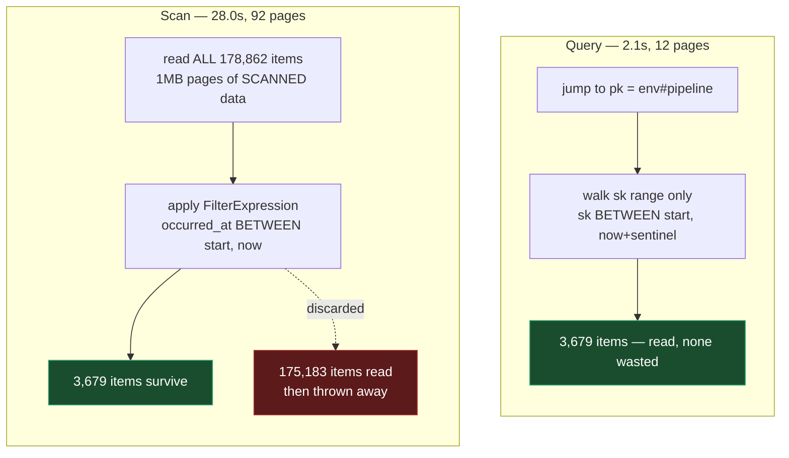
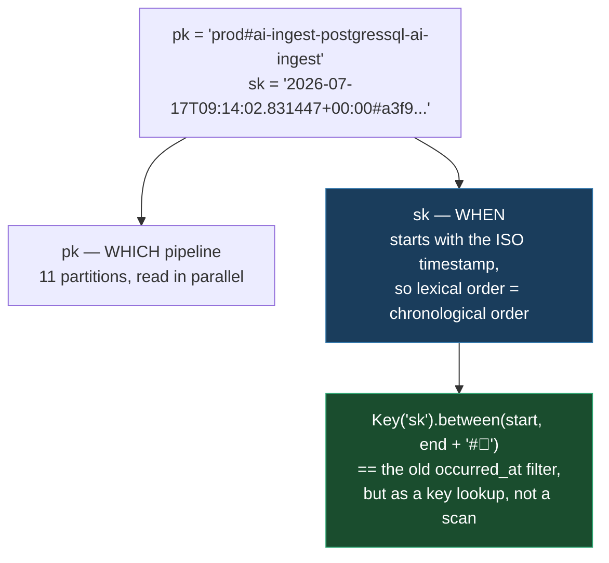
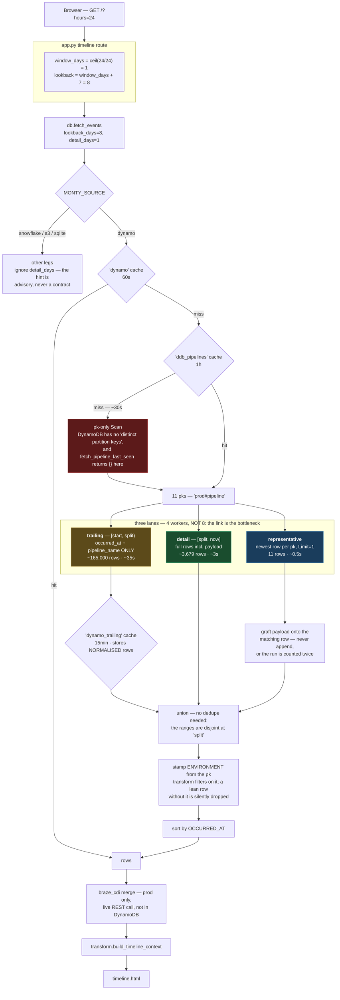
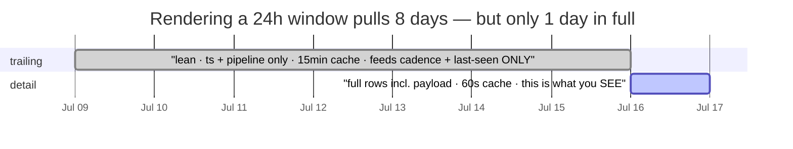

# Monty dashboards — pipeline timeline + anomaly detection

Two Flask-served dashboards over the Monty events table in Snowflake, driven by
the real schema in your export (`PIPELINE_NAME`, `METRIC_NAME`, `METRIC_VALUE`,
`SEVERITY`, `OCCURRED_AT`, `IS_ALERT`, ...).

```
monty/
  app.py                 Flask routes:  /  and  /anomalies  (+ /api/*)
  db.py                  Snowflake fetch (CSV fallback for local dev)
  transform.py           all the logic: builds template context from raw rows
  sql/
    fetch_events.sql     the one query that feeds both dashboards
    anomaly_scores.sql   optional: same detector, computed in Snowflake
  templates/
    timeline.html        your 03_pipeline_timeline mockup, now data-driven
    anomaly.html         your anomaly mockup, now data-driven
  requirements.txt
```

## Quick start — the full dashboard (Snowflake + DynamoDB + S3 history)

Everything is already configured in `dash/.env` (`MONTY_SOURCE=both`, Snowflake
creds, AWS profiles). `app.py` loads `.env` itself, so you only need three steps:

```bash
# 1. one-time: install deps
pip install -r requirements.txt

# 2. every day: refresh the SSO sessions for the two AWS accounts
#    (they cover BOTH the DynamoDB tables and the legacy S3 buckets; expired ->
#     those legs return 0 rows with "session has expired")
aws sso login --profile audiences-dev      # dev  account 116981766237
aws sso login --profile SWEATAnalytics     # prod account 534977985440

# 3. run it
cd dash && python3 app.py
#   http://localhost:5000/            timeline
#   http://localhost:5000/anomalies   anomaly detection
```

**The DynamoDB migration is COMPLETE (2026-07-17)** — both envs write live and
the history was replayed in (see "Backfill" below). `MONTY_SOURCE=dynamo` alone
now serves the whole `warning`/`info` window, so **the fastest useful config is
`MONTY_SOURCE=both` with `MONTY_BOTH_WARN_SOURCE=dynamo`** (skips the slow S3
leg entirely).

**With the default `MONTY_BOTH_WARN_SOURCE=union`, the first page load is slow
(~1-3 min) and that is normal, not a hang.** `both` unions Snowflake
(`critical`/`error` + every dbt/auditor row) with the lambda `warning`/`info`
legs: DynamoDB (live + backfilled), the SQLite cache, and legacy S3. The S3 leg
is the slow one — thousands of tiny Parquet files; the DynamoDB leg is one
paginated Scan. The sqlite/S3 legs are now redundant belt-and-braces and can be
dropped. Everything is cached afterwards (`MONTY_TTL_DYNAMO` / `MONTY_TTL_S3`,
default 60s), so every refresh is ~1s. If you don't need the `warning`/`info`
rows at all, set `MONTY_SOURCE=snowflake` for an instant (<1s) load.

## Backfill — replaying history into DynamoDB (`backfill_dynamo.py`)

Already run for the cutover; kept for re-runs / other windows. It reads the old
stores through the dashboard's own readers (so rows are normalised identically
to the live writer) and replays `warning`/`info` into `monty-<env>-metrics-ddb`.

```bash
aws sso login --profile SWEATAnalytics          # or audiences-dev
cd dash
python3 backfill_dynamo.py --env prod --days 28 --dry-run   # reads only, no writes
python3 backfill_dynamo.py --env prod --days 28             # apply
```

- **Idempotent** — `sk = "<occurred_at>#<source ID>"` (not the live writer's
  `uuid4`), so a re-run overwrites the same items instead of duplicating. Safe
  to resume after a failure.
- **TTL replays correctly** — `occurred_at + 90d`, so a 3-week-old row lands
  with ~69 days left, not a fresh 90.
- **`critical`/`error` are excluded by design** — they belong in Snowflake.
- `--source both|sqlite|s3` (default `both`). SQLite only holds what the ingest
  job archived; reaching further back needs the S3 leg. It self-loads `.env`, so
  the per-env AWS profile resolves automatically.

To change source/behaviour, edit `dash/.env` — it is authoritative and overrides
your shell env on every launch. Restart `python3 app.py` after any `.env` change
(Flask's reloader re-reads `.py` files only, never env vars).

## Run it locally (against the CSV, no Snowflake needed)

```bash
pip install -r requirements.txt
MONTY_SOURCE=csv MONTY_CSV=sample_events.csv flask --app app run
# http://localhost:5000/          timeline
# http://localhost:5000/anomalies anomaly detection
```

## Point it at Snowflake

Set the table and connection, then unset the CSV source:

```bash
export MONTY_TABLE="MONITORING_DB.MONITORING.CUSTOM_METRICS"   # <- your real table
export SNOWFLAKE_ACCOUNT=...  SNOWFLAKE_USER=...  SNOWFLAKE_PASSWORD=...
export SNOWFLAKE_ROLE=...
# SNOWFLAKE_WAREHOUSE is optional — omit it to use the user's DEFAULT_WAREHOUSE.
flask --app app run
```

### Or reuse your existing `snowsql` connection (no secrets in the environment)

If you already have a `[connections.<name>]` block in `~/.snowsql/config`, point
the dash at it instead of exporting credentials:

```bash
export MONTY_SNOWSQL_PROFILE=dev        # reads [connections.dev]
```

It maps `accountname/username/password/warehousename/rolename/dbname/schemaname`
onto the connector. Any `SNOWFLAKE_*` env var still overrides the matching field,
so you can keep the profile and just swap the warehouse or role.

`MONTY_TABLE` in `db.py` is the only thing you must change. To fold these into
your existing app instead of running `app.py`, copy the four routes from
`app.py` and the `templates/` + `sql/` folders across.

## Point the timeline/anomaly events at DynamoDB (live warn/info)

Since the 2026-07-17 cutover the lambda `warning`/`info` metrics land in
DynamoDB (`monty-{env}-metrics-ddb`, written by `lambdas/shared/
dynamo_writer.py`). The core event source can read it directly:

```bash
export MONTY_SOURCE=dynamo
# table is a pattern; {env} is filled from the PROD/DEV toggle:
export MONTY_DDB_TABLE="monty-{env}-metrics-ddb"   # default
# export MONTY_DDB_REGION=us-east-1                 # default
flask --app app run
```

Rows are normalised to the same contract as every other source. Per-env AWS
credentials resolve exactly like the S3 reader below (`MONTY_S3_PROFILE_<ENV>`
etc. — same two accounts).

### How the reader is fast (and why it looks the way it does)

The reader **Queries per pipeline over an `sk` range**; it does not Scan.
Measured on prod (178,862 items, 2026-07-17):

| | rows | pages | time |
|---|---|---|---|
| 24h window via `Scan` | 3,679 | 92 | **28.0s** |
| 24h window via `Query` | 3,679 | 12 | **2.1s** |

Both return identical rows. The reason Scan is slow is not the filter — it is
that Scan's 1MB page limit applies to **scanned** data, *before*
`FilterExpression` runs, so even a 24h window pages over the whole table. Every
Scan of this table costs ~28s no matter how narrow the window, **and that floor
grows with the table**. The cost model that fits every measurement:

```
Scan:   ~28s  +  bytes/0.47MBps                 <- floor is the whole table
Query:          bytes/0.47MBps + rows/10400ps   <- no floor
```

#### Why Scan was slow

The filter was never the problem. DynamoDB applies `FilterExpression` **after**
reading, and the 1MB page limit counts what was *read*, not what survived — so
asking for one day still dragged the whole table past the filter.



Identical rows out. The difference is entirely what got read to produce them —
and the wasted 175,183 grows every day, while the Query path does not.

#### The key IS the index

No GSI was needed because the sort key already begins with the timestamp, so
sorting by `sk` *is* sorting by time. A range over `sk` is a range over
`occurred_at`, for free, on the table exactly as it already exists.



The `#￿` upper sentinel exists because sk carries a `#<uuid>` suffix after
the timestamp: it must sort above every possible id, or the newest events in the
window get cut off. The lower bound has no sentinel when the range must be
**exclusive** — which is what keeps the two lanes below from overlapping.

#### The read path — process and data flow



#### What each lane is for, on the time axis

The two window lanes never overlap — `split` belongs to **detail** only.



`payload` is dropped from the trailing lane because it is ~3x of all other bytes
and the dashboard renders it on ~28 rows out of ~175,000. `environment` is
dropped because the pk already encodes it. What is left — a timestamp and a
pipeline name — is all the tail is ever asked for: how often did this normally
run, and when was it last seen.

**No GSI is needed, and none should be added.** `sk` is
`"<occurred_at ISO>#<uuid>"`, so it *already is* a time index — an `sk` range
over one `pk` is exactly the old `occurred_at` filter, per pipeline. A
time-bucketed GSI would be strictly worse: Query on a single pk has no
`Segment`, so bucketing by time would serialise what `pk="<env>#<pipeline>"`
already parallelises 11 ways, while write-amplifying every item and risking GSI
throttling that backpressures the metric writers.

Three lanes, because they have very different costs and freshness needs:

| lane | what | cost | cache |
|---|---|---|---|
| **detail** | the visible window, full rows incl. payload | ~3s | `MONTY_TTL_DYNAMO` (60s) |
| **trailing** | the 7d tail, `occurred_at` + `pipeline_name` only | ~35s | `MONTY_TTL_DYNAMO_TRAILING` (900s) |
| **representative** | newest row per pipeline, for payload identity | ~0.5s | with the detail lane |

`app.py` asks for this via `db.fetch_events(..., detail_days=N)` — a *hint*
meaning "older rows may be lean". The trailing tail feeds only cadence and
last-seen, which move over hours, so it caches long; the detail lane is what
the user is looking at, so it stays near-live. The two ranges are **disjoint**
(`_sk_bounds(..., include_end=False)`), which is what lets the union skip
de-duplication — an event landing exactly on the split would otherwise be
counted twice.

`payload` is projected off the trailing lane because it is ~3x of all other
bytes; `environment` is too, since `pk` already encodes it (it is re-stamped
after the read — `transform` filters on it, so a lean row that omitted it would
be silently dropped and cadence history would vanish).

Result: **155s → ~61s cold, ~7.6s warm, ~0s hot** (was ~155s on essentially
every render, since the single 60s cache expired constantly).

| knob | default | notes |
|---|---|---|
| `MONTY_TTL_DYNAMO` | `60` | detail lane |
| `MONTY_TTL_DYNAMO_TRAILING` | `900` | trailing lane; only affects cadence/staleness freshness |
| `MONTY_TTL_DDB_PIPELINES` | `3600` | pipeline list |
| `MONTY_DDB_WORKERS` | `4` | **8 measured SLOWER than 4** — the link is the bottleneck, so more streams contend. Re-measure before raising. |
| `MONTY_DDB_PIPELINES` | *(unset)* | comma-separated names; skips the ~30s discovery Scan. A pipeline missing from the list is **invisible** — prefer the cache. |

Query needs to be told which partitions to read, and DynamoDB has no "distinct
partition keys", so `_ddb_pipelines` discovers them with a `pk`-only Scan
(~30s, cached 1h). `db.fetch_pipeline_last_seen` deliberately returns `{}` for
this source and cannot be reused for it.

### Known remaining cost

The trailing lane is ~165k rows for 7 days and dominates a cold render — not in
bytes (it is lean) but in **row count**: ~17s of Python coercion regardless of
where it runs. Cutting it needs fewer *rows*, i.e. a pre-aggregated
`(pipeline, 15-minute bucket)` marker — the lane only needs the *set* of
buckets (`_session_starts` collapses on a 30-min gap; `last_seen` takes a max),
so a marker needs nothing but its key: `pk="agg#<env>#<YYYYMMDD>"`,
`sk="<pipeline>#<HH:MM>"` + `ttl`. ~9k items/7d ≈ 550KB. That grain also
matches `SEASONAL_MAX_GRID=720` (7d → 14-min cells). Deliberately **not** built
yet: it needs a writer change plus a replay, and the caches make the warm path
~7.6s without it.

**0.47 MB/s is a laptop uplink, not a DynamoDB limit** (three independent runs
landed within 8%, and parallel Scan got *worse* — a saturated link, not CPU).
Deploying the dashboard **in-region (us-east-1)** should remove most of what is
left. That host will also need `grant_read_data` on the table:
`infra/monty_stack.py` grants the Lambdas **write only**.

## Point the timeline/anomaly events at S3 (Parquet) — pre-cutover history

The per-environment metric buckets hold the **pre-cutover** `warning`/`info`
history (the lambdas no longer write here). The reader remains for that
history. Requires `boto3` + `pyarrow` (already in `requirements.txt`) and AWS
credentials via the standard boto3 chain (env keys, `AWS_PROFILE`, or an
instance/task role).

```bash
export MONTY_SOURCE=s3
# bucket is a pattern; {env} is filled from the PROD/DEV toggle:
#   prod -> s3://monty-prod-metrics/run_date=YYYYMMDD/*.parquet
#   dev  -> s3://monty-dev-metrics/run_date=YYYYMMDD/*.parquet
export MONTY_S3_BUCKET="monty-{env}-metrics"   # default; override if named differently
# export MONTY_S3_PREFIX="some/prefix"          # optional, before run_date= (default: root)
# export MONTY_S3_TZ=UTC                         # default; the writer stamps UTC
flask --app app run
```

### Dev and prod live in different AWS accounts

`monty-dev-metrics` is in account `116981766237` and `monty-prod-metrics` is in
`534977985440`, so one credential can't read both. Give the reader a profile per
environment and the PROD/DEV toggle switches accounts with it:

```bash
export MONTY_S3_PROFILE_DEV=audiences-dev     # account 116981766237
export MONTY_S3_PROFILE_PROD=SWEATAnalytics   # account 534977985440
# or, if your profile names share a shape:  export MONTY_S3_PROFILE='monty-{env}'
aws sso login --profile audiences-dev
aws sso login --profile SWEATAnalytics
```

Resolution order: `MONTY_S3_PROFILE_<ENV>` → `MONTY_S3_PROFILE` (a `{env}`
pattern) → the default credential chain (single account / instance / task role,
which is what a deployed dashboard would use).

## The `/segment` page has its OWN source

Segment search introspects `SEGMENT_EVENTS.INFORMATION_SCHEMA`, which only
exists in Snowflake — so it is independent of `MONTY_SOURCE` (where the Monty
*event* rows come from). It has its own switch:

```bash
# force real Snowflake segment data even while events run off CSV/S3:
export SEGMENT_SOURCE=snowflake
```

`SEGMENT_SOURCE` defaults to **Snowflake**. It only uses the local
`segment_sample.csv` when you set `SEGMENT_SOURCE=csv`, OR (for offline laptop
dev) when the whole app is in `MONTY_SOURCE=csv` mode and `SEGMENT_SOURCE` is
unset. The header shows a **SNOWFLAKE** / **CSV SAMPLE** badge so you always
know which one you're looking at.

The reader enumerates every `run_date=YYYYMMDD/` partition overlapping the
lookback window, reads all `*.parquet` objects, and applies the exact
`[start, now]` + `ENVIRONMENT` filter in Python. Rows come back on the same
contract as the Snowflake/CSV paths (naive-UTC `OCCURRED_AT`, `float|None`
`METRIC_VALUE`, `bool` flags).

**Note on the producer split:** the routing is per *producer*, not purely per
severity.

| producer | where its rows land |
|---|---|
| Lambdas (`metric_writer`) | `critical`/`error` → Snowflake · `warning`/`info` → DynamoDB (S3 pre-cutover) |
| dbt hooks, auditor proc | **all severities → Snowflake** (they run inside Snowflake and cannot write DynamoDB) |

So a **DynamoDB- or S3-only source shows neither failures nor any dbt metric**.
The credits chart and `/segment` page always use Snowflake (they read
Snowflake-internal views with no external equivalent), so `SNOWFLAKE_*` creds
are still needed for those.

## Complete picture: `MONTY_SOURCE=both`

To see everything, use `both` — the **union** of the stores: Snowflake (lambda
`critical`/`error` **plus every dbt/auditor row, `info` included**) and the
`warning`/`info` legs — by default DynamoDB (live) + SQLite cache + legacy S3
(`MONTY_BOTH_WARN_SOURCE=union`; set it to `dynamo`/`sqlite`/`s3` to read a
single leg, e.g. `dynamo` once the S3 history has aged out). Needs the
`SNOWFLAKE_*` and AWS-profile config above:

```bash
export MONTY_SOURCE=both
# ... SNOWFLAKE_* and MONTY_S3_PROFILE_* / MONTY_DDB_* as above ...
flask --app app run
```

The stores are disjoint in practice (verified: zero overlapping
`(pipeline, metric, occurred_at)` keys), and rows are deduped on that natural
key anyway, so nothing is double-counted — the dedup is also what makes the
S3→DynamoDB cutover seamless (history from S3/SQLite, live tail from DynamoDB).
It is resilient: if one store is unreachable it's logged and the others still
render, so the dashboard never fails because a single source hiccuped.

## Performance

A page load makes four Snowflake queries. Two things dominate, and both are
handled in `db.py`:

1. **Connection reuse.** Opening a connection costs ~1.6s of auth handshake, and
   we used to open one per query (~6.5s of pure overhead). There is now a single
   process-wide connection, lock-guarded and transparently reopened if dropped.
2. **Caching the slow, lagging views.** `ACCOUNT_USAGE` lags real time by 1-3h
   and is slow (the credits query measured 1.6-11.8s), so caching it costs no
   freshness. **Live event rows are never cached.**

3. **The credits chart is PAUSED.** Its two `ACCOUNT_USAGE` queries were the
   slowest thing in the app, so they are skipped entirely by default. Nothing
   was deleted — the SQL, the fetch code and the chart are all intact:

   ```bash
   export MONTY_ENABLE_CREDITS=1   # bring the credits chart straight back
   ```

4. **S3 events are the cold-load bottleneck, so they're cached + read in
   parallel.** Historical `run_date=` partitions are one consolidated file each
   (fast), but *today's* partition is thousands of tiny live-write files (~8s to
   read). In `both` mode Snowflake and S3 are fetched **concurrently** (S3 ~8s
   dwarfs Snowflake ~0.8s, so the merge waits on the slower one, not the sum),
   and the S3 read is cached for `MONTY_TTL_S3` so every refresh after the first
   is instant. `MONTY_S3_WORKERS` (default 48) tunes read concurrency.

| env var | default | caches / controls |
|---|---|---|
| `MONTY_ENABLE_CREDITS` | `0` (paused) | — turns the credits chart on/off |
| `MONTY_TTL_S3` | 60s | S3 warn/info events (biggest win) |
| `MONTY_S3_WORKERS` | 48 | parallel S3 object reads |
| `MONTY_TTL_CREDITS` | 300s | hourly warehouse credits |
| `MONTY_TTL_PEAKS` | 1800s | all-time credit peaks |
| `MONTY_TTL_LAST_SEEN` | 120s | pipeline last-seen (ghost lanes) |

Measured on dev `both` mode: **~10s → ~7.8s cold → ~0.6s warm.** The remaining
cold cost is purely the count of un-aggregated files in today's S3 partition —
the real fix is producer-side hourly aggregation, not the dashboard.

Set any to `0` to disable that cache. Measured on dev: **18.0s → 7.2s cold →
0.75s warm.** The Python `transform` layer is ~0.03s — it is never the bottleneck.

## How each dashboard is built

**Timeline.** One 7-day pull. `transform.build_timeline_context` groups events
into "runs" (events a pipeline emits in the same minute = one invocation),
colours each run by its worst severity, and marks alerts. Staleness is inferred
per pipeline: it computes each pipeline's own median gap between runs, and flags
it STALE when the time since its last event exceeds ~3× that cadence. So you
never hard-code "expected hourly" — it learns each pipeline's rhythm.

**Anomaly detection.** For every numeric metric, it scores the latest value
against that metric's own trailing baseline using a **robust z-score**
(median + MAD, not mean + stddev — so one bad point doesn't poison the
baseline). The baseline is a **smooth curve that hugs the data**, consistent
across every chart, in one of three flavours the header badges: **`seasonal ~Nh`**
when the metric is dense over enough full cycles to trust a period (STL
trend + seasonal, band width breathes per phase — z measures "off *for this point
in the cycle*"); **`smooth trend`** when there's no trustworthy cycle but enough
history (a robust rolling smoother that follows the rise/fall instead of a flat
slab); **`flat`** for very short series or if `statsmodels` is missing. The
seasonal gate is deliberately strict (needs raw density over several cycles) so a
thin series never over-fits a fake wave. A point is flagged only when BOTH
`|z| ≥ 3.5` AND the change is `≥ 10%` — the percent gate kills the "far in sigma
but only moved 2%" false alarms. Only the scored latest point is dotted (no
historical red-dot spam). Monotonic watermark metrics (`*.max_date`,
`*watermark*`) are excluded — *freshness* signals, covered by the timeline's
STALE status.

**Sensitivity / the threshold.** The knob is `z_threshold` (robust-σ, *not* a
literal percentile — but they map directly: 2σ ≈ 97.7th pctile → `z≈2.0`, 98th →
`z≈2.05`, default `3.5` ≈ 99.98th). Change the default in `app.py` (`DEFAULTS`),
or tune per request without redeploying: `/anomalies?z=2.05&min_pct=20&days=14`.
The seasonal detector needs `statsmodels>=0.14` (in `requirements.txt`); its
`SEASONAL_*` knobs live at the top of `transform.py`. Full detail in
`MAINTENANCE.md` §8.

## Formatting — pipeline name → family / kind (`formatting.py`)

Both dashboards group and tag pipelines by **name alone** (no config, no lookup
table) using two pure helpers in `dash/formatting.py`. They're called by
`transform.py` at render time, **once per distinct pipeline** as it builds each
timeline lane / anomaly group — `build_timeline_context`,
`build_timeline_range_context`, and `build_anomaly_context`. Pure string in →
string out, so they're cheap and unit-testable in isolation.

**`pipeline_family(name)`** collapses related pipelines into one family so the
dozens of one-off models don't each spawn a lane. First matching rule wins:

| Input pattern | Rule | Example → family |
|---|---|---|
| contains `-ai-` | split on `-ai-`, take the head (lambda ingest stages) | `ai-ingest-postgressql-ai-load-sn` → `ai-ingest-postgressql` |
| starts with a dbt-test prefix (`not_null_`, `unique_`, `accepted_values_`, `relationships_`, `dbt_utils_`, `expect_`) | all tests collapse to one family | `not_null_dim_x_id` → `dbt tests` |
| contains `__` (dbt source segment) | split on `__`, take the head | `stg_braze__email_click` → `stg_braze` |
| first `_`-segment is a dbt layer (`stg`/`int`/`mart`/`dim`/`fct`/`agg`/`base`) | use the layer as the family | `dim_dates` → `dim` |
| otherwise | the name is its own family | `plausible` → `plausible` |
| empty | `—` | |

**`kind(name)`** classifies a pipeline into a source category for its icon/tag:

| Returns | When | Used for |
|---|---|---|
| `aws` | name starts with `ai-ingest` / `ingest` | lambda-ingest icon |
| `dbt` | first segment is `stg`/`mart`/`fct`/`dim`/`int`, or starts with `dbt` | dbt model/test icon |
| `sf` | `plausible`, `iterate`, `auditor_heartbeat`, or name contains `alarm` | Snowflake-native icon |
| `task` | everything else | default tag |

Both are dashboard-only display logic — the observer/Slack alert path does **not**
use them. To change grouping, edit the rule lists (`DBT_LAYERS`,
`DBT_TEST_PREFIXES`) at the top of `formatting.py`; nothing else needs to change.

## Notes / next steps

- The detector currently flags spikes and drops equally. Operationally, **drops**
  usually matter more (a volume drop = something broke upstream). Filter with
  `direction == 'drop'` if you want a drop-only alerting view.
- For a full 24h timeline you need ~24h of live data; the sample export thins out
  near its end, so the trailing-24h view is sparse there. It fills in once live.
- `sql/anomaly_scores.sql` moves the whole detector into Snowflake for when the
  Python-side stats over a large window get heavy. Same output, same thresholds.
- Both templates keep your original CSS, so restyling stays in the HTML.
